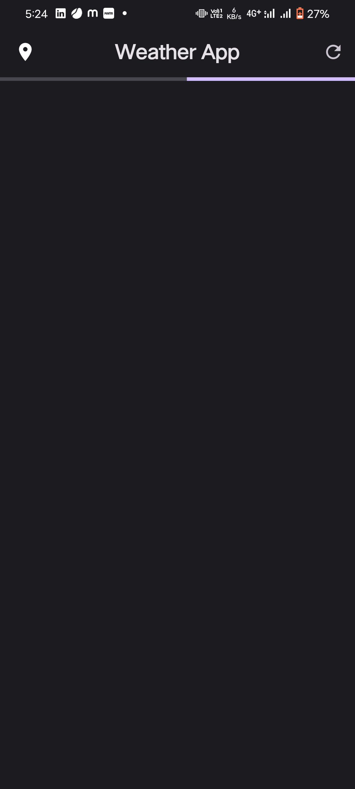

<html>
<body>
    <header>
        <h1>Flutter Weather App</h1>
        
Your Go-To Application for Real-Time Weather Updates

    </header>
    <section>
        <h2>Features</h2>
        <ul>
            <li><strong>Real-Time Weather Updates:</strong> Stay informed with up-to-date weather information.</li>
            <li><strong>Geolocation:</strong> Automatically fetches your current city for personalized weather data.</li>
            <li><strong>Intuitive UI:</strong> User-friendly design for a seamless experience.</li>
            <li><strong>OpenWeather API:</strong> Reliable and accurate weather data source.</li>
        </ul>
    </section>
    <section class="download-instructions">
        <h2>How to Download</h2>
        <ol>
            <li><strong>Download APK:</strong> Visit the <a href="https://github.com/your_username/your_repo/releases">Releases</a> section of this repository.</li>
            <li><strong>Locate the latest release</strong> with the build name "app_release".</li>
            <li><strong>Download the APK file</strong> to your Android device.</li>
            <li>
                <strong>Install the App:</strong>
                <ul>
                    <li>Once the download is complete, open the APK file.</li>
                    <li>You may need to enable installations from unknown sources. To do this, go to <code>Settings > Security > Install unknown apps</code> and enable your browser or file manager.</li>
                    <li>Follow the on-screen instructions to install the app.</li>
                </ul>
            </li>
            <li><strong>Enjoy the Weather:</strong> Open the app and allow location access. Explore real-time weather updates for your current location and more.</li>
        </ol>
    </section>
    <h2> Screenshots -: </h2> 
    <section class="screenshots">
        

            
            
            
        

    </section>
    <section>
        <h2>Support and Feedback</h2>
        
For any issues or feedback, please <a href="https://github.com/RohanSagar11/FLutter-Projects/issues">Open an Issue on GitHub</a>
            We appreciate your contributions and hope you enjoy using the Flutter Weather App!

        
<strong>Note:</strong> This app relies on OpenWeather API, and you may need to sign up for an API key. Refer to the <a href="https://openweathermap.org/">OpenWeather website</a> for more information on obtaining your API key.

    </section>

</body>
</html>
